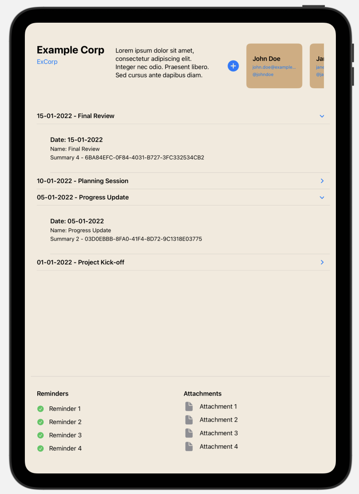
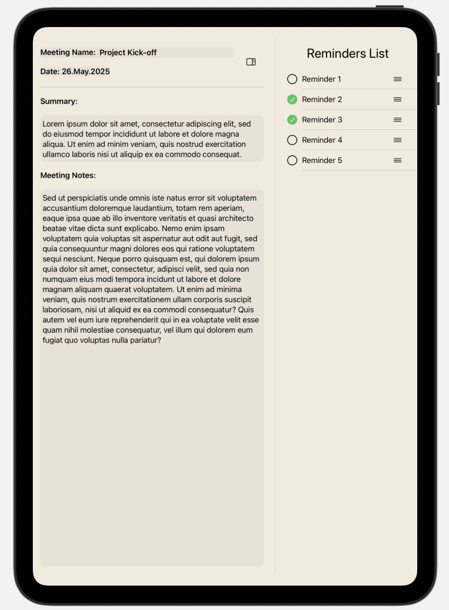
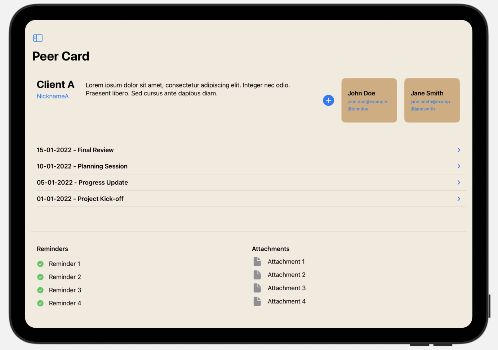
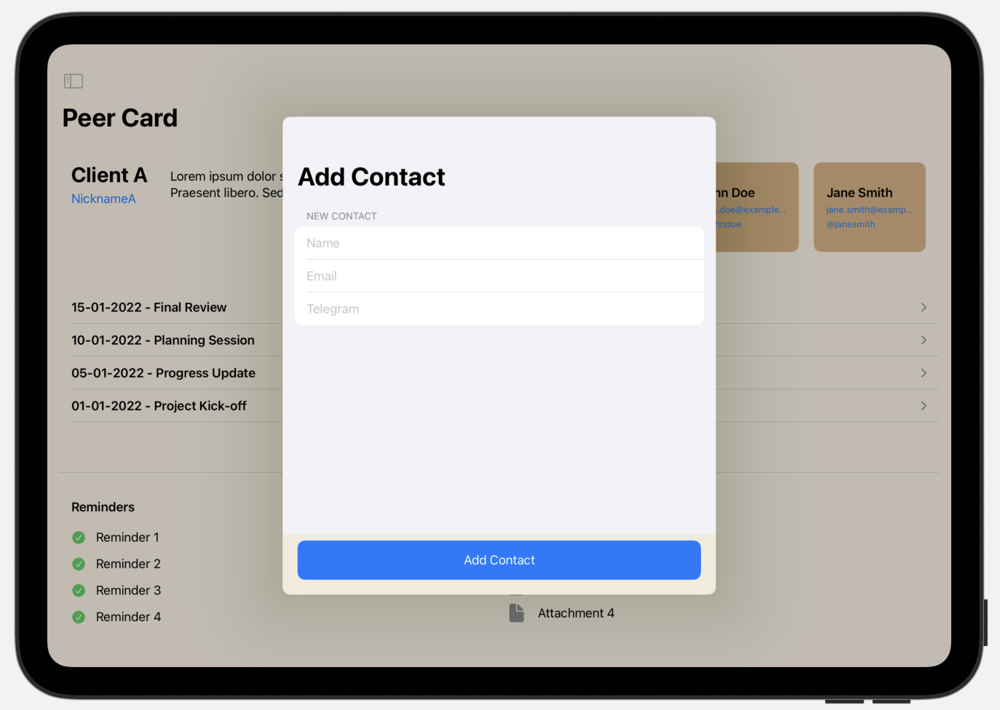

# 📒 Remarco

**Remarco** is a prototype of a hybrid personal productivity app that combines ✍️ note-taking, ⏰ reminders, and 👥 micro-CRM features — all designed for local use.

---

## 📌 About the Project

This app allows you to:

- 👤 Create and manage peers (clients, partners, etc.)
- 🔗 Add related contacts (email, Telegram, etc.)
- 📝 Keep a history of meetings and notes for each peer
- ⏳ Set reminders linked to peers and meetings
- 📎 Attach files and documents to notes

> ⚠️ This is a **visual prototype**, using `CoreData` as a simple local storage. It is not intended for production use.

---

## 🚧 Status

The project is in a **prototype/mockup** phase and not finalized. It demonstrates the concept only.

---

## 🖼️ Screenshots

| Screen 1 | Screen 2 |
|----------|----------|
|  |  |

| Screen 3 | Screen 4 |
|----------|----------|
|  |  |

> 💡 Screenshots are located in the `screenshots/` folder. Make sure they are uploaded to your repo.

---

## ▶️ How to Run

1. Open the project in **Xcode**
2. Build and run on a simulator or a real device

---

## 🛠️ Ideas for Future Development

- 🔁 Migrate to `SwiftData`
- ✅ Finalize the app for release
- 📅 Integrate with system calendars
- ⏰ Advanced reminders and attachment support
- 🎨 Improved UI and UX

---

## 👨‍💻 Author

**Nikolay K**, 2024  
© All rights reserved.
